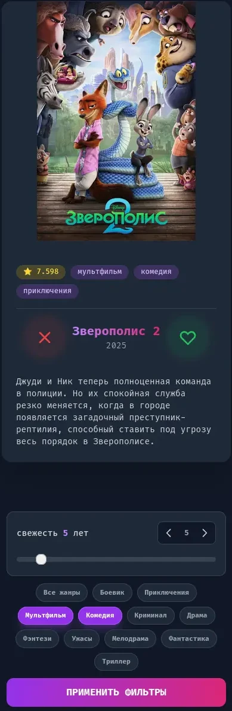
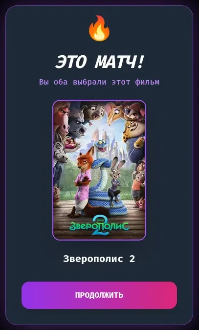

# FilmMatch — Совместный выбор фильмов в стиле Tinder

Веб-приложение для парного выбора фильмов: свайпайте фильмы, получайте матчи и смотрите вместе.

<div align="center">
  
  
</div>

## 🚀 Быстрый старт

```bash
# Запуск через скрипт (рекомендуется)
./start.sh

# Остановка
docker-compose down

# Остановка с очисткой данных
docker-compose down -v
```

**Доступ:**
- Frontend: http://localhost:3000
- Backend API: http://localhost:8001
- API Docs: http://localhost:8001/docs

## 🛠 Стек

| Компонент | Технологии |
|-----------|-----------|
| Frontend | React 18, Vite, TailwindCSS |
| Backend | Python 3.11, FastAPI, SQLAlchemy, JWT |
| БД | PostgreSQL 15 |
| API | TMDB (постеры, описания) |

## 📦 Структура

```
FilmMatch/
├── backend/app/       # FastAPI API
├── frontend/src/      # React компоненты
├── database/init/     # SQL миграции
├── docker-compose.yml
├── .env               # Переменные окружения (не в git)
├── .env.example       # Шаблон переменных
└── start.sh           # Скрипт запуска
```

## 🔑 Переменные окружения

**Скопируйте `.env.example` в `.env` и настройте:**

```bash
cp .env.example .env
```

```env
# Database
POSTGRES_USER=user
POSTGRES_PASSWORD=SecurePass2024
POSTGRES_DB=movie_matcher
DATABASE_URL=postgresql://user:SecurePass2024@db:5432/movie_matcher

# TMDB API (получите на https://www.themoviedb.org/settings/api)
TMDB_API_KEY=your_api_key_here
TMDB_BEARER_TOKEN=your_bearer_token_here
TMDB_PROXY_URL=  # Оставьте пустым или укажите прокси

# JWT Secret (смените на случайную строку!)
JWT_SECRET=your-secret-key-change-in-production

# Frontend URL (для CORS)
FRONTEND_URL=http://localhost:3000
```

## 📡 API Endpoints

| Метод | Эндпоинт | Описание |
|-------|----------|----------|
| `POST` | `/register` | Создать пользователя |
| `POST` | `/login` | Получить JWT токен |
| `GET` | `/movies/next` | Следующий фильм для свайпа |
| `POST` | `/swipe` | Свайп (возвращает `is_match`) |
| `POST` | `/movies/discover` | Загрузить фильмы из TMDB |
| `GET` | `/users/active` | Список активных пользователей |
| `DELETE` | `/users/{user_id}` | Удалить пользователя (завершить сессию) |
| `DELETE` | `/users/me/swipes` | Очистить свайпы текущего пользователя |

## 🧹 Полезные команды

```bash
# Запуск (через скрипт)
./start.sh

# Пересоздать БД
docker-compose down -v && ./start.sh

# Добавить фильмы вручную
curl -X POST http://localhost:8001/movies/discover

# Логи
docker-compose logs -f backend
docker-compose logs -f frontend

# Проверка API
curl http://localhost:8001/users/active
```

## 📝 Особенности

- **JWT аутентификация** — токен хранится в localStorage
- **Матчинг** — уведомление при взаимном лайке
- **Фильтры** — по году, жанрам, просмотренным
- **Ленивая загрузка** — автоподгрузка фильмов из TMDB при нехватке
- **Управление сессиями** — список активных пользователей с возможностью завершения

## 🔐 Безопасность

- ✅ Секреты вынесены в `.env` (не в репозитории)
- ✅ JWT токены для аутентификации
- ✅ CORS ограничен до `FRONTEND_URL`
- ✅ SSL проверка для TMDB API
- ✅ Пароль БД без спецсимволов (для совместимости)
